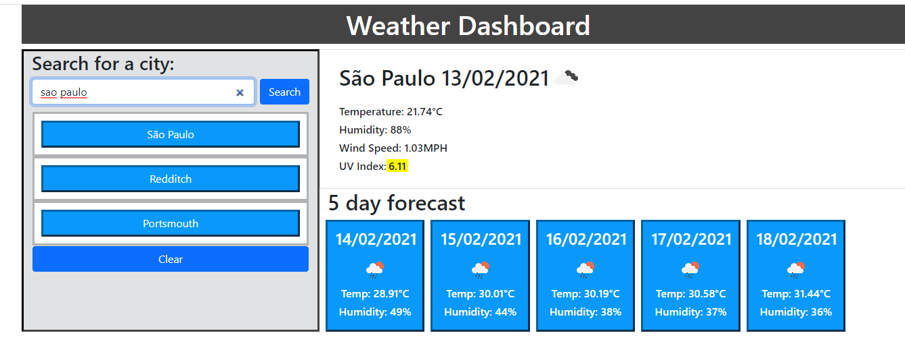

# Weather Dashboard  

## Explanation of the application  
Using the open weather API's, to create a page that would search for the current weather and 5 day forecast for city, display it on a page, along with all recent searches, and for those searches to remain on page refresh.  

## Live link to the deployed app

The live site is found at [GitHubPages](https://clairemdavies.github.io/weather-dashboard/)

 
## Screenshots of the application  

Screenshots of the page are shown below: 
 
 
 

## Technologies used  
- HTML
- CSS
- Javascript
- Jquery
- API's

## License

Licensed under the [MIT License](LICENSE)

## Contact Information 

Claire Davies: [Github](https://github.com/ClaireMDavies)
